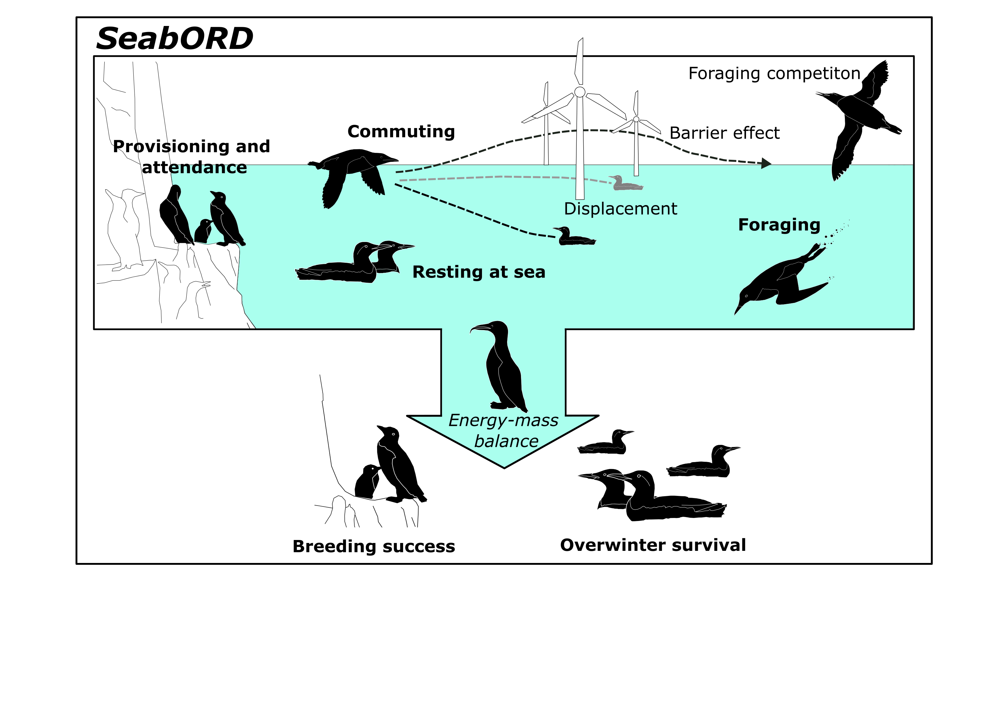

# SeabORD-R

DRAFT UNDER REVIEW: FOR UKCEH INTERNAL USE ONLY. DO NOT CIRCULATE.

SeabORD-R Version 2.0.0

The purpose of the model is to predict the demographic effects on seabirds of displacement and barrier effects resulting from offshore renewable developments (ORDs), evaluated through adult survival and productivity translating from time/energy budgets of four different seabird species during the chick-rearing period. To determine the impacts of ORDs, baseline scenarios are compared with scenarios containing one or more ORDs. 

Acknowledgements: This work was funded by (i) The Offshore Wind Evidence and Change programme, led by The Crown Estate in partnership with the Department for Energy Security and Net Zero and Department for Environment, Food & Rural Affairs through the Predators and Prey Around Renewable Energy Developments (PrePARED) project and by (ii) Scottish Government’s Contract Research Fund. We wish to thank Marine Directorate and members of Project Steering Groups for support and guidance throughout this project. Data used to parameterise the model were supported by UKCEH National Capability for UK Challenges programme NE/Y006208/1 and the Joint Nature Conservation Committee. 

------------------------------------------------------------------------

#### "example article title"

DOI: [example doi link](https://www.pnas.org/doi/abs/10.1073/pnas.2001988117)

This link will be updated with the accompanying SeabORD paper in due course.
