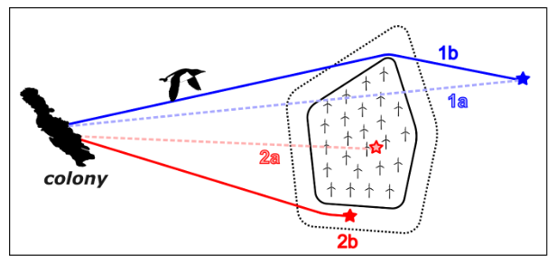

```{r, include = FALSE}
knitr::opts_chunk$set(
  collapse = TRUE,
  comment = "#>"
)
```

```{r setup, warning = FALSE, message = FALSE }
library(seabORD)
```

Etiam in porta leo, vel laoreet turpis. Curabitur rhoncus odio vitae leo eleifend, sit amet semper nibh condimentum. Donec vitae risus dui. Suspendisse tincidunt justo et massa rutrum, at dictum purus placerat. Nullam vel commodo est, nec porta leo. In id neque in neque tincidunt sollicitudin. Mauris fringilla placerat erat dictum congue. Suspendisse et lobortis arcu. Sed ultrices aliquam eleifend. Morbi vestibulum efficitur auctor. Suspendisse potenti. Morbi egestas sapien nisi. Donec a tortor ut nisl molestie mollis. Fusce ultricies purus sed massa dapibus, nec pretium odio dapibus. Mauris tristique, libero vel semper efficitur, est nisl semper nisl, non vestibulum eros massa vitae tellus. Donec lobortis porttitor nisl, vitae tempor ante gravida ac.

Etiam in porta leo, vel laoreet turpis. Curabitur rhoncus odio vitae leo eleifend, sit amet semper nibh condimentum. Donec vitae risus dui. Suspendisse tincidunt justo et massa rutrum, at dictum purus placerat. Nullam vel commodo est, nec porta leo. In id neque in neque tincidunt sollicitudin. Mauris fringilla placerat erat dictum congue. Suspendisse et lobortis arcu. Sed ultrices aliquam eleifend. Morbi vestibulum efficitur auctor. Suspendisse potenti. Morbi egestas sapien nisi. Donec a tortor ut nisl molestie mollis. Fusce ultricies purus sed massa dapibus, nec pretium odio dapibus. Mauris tristique, libero vel semper efficitur, est nisl semper nisl, non vestibulum eros massa vitae tellus. Donec lobortis porttitor nisl, vitae tempor ante gravida ac.


